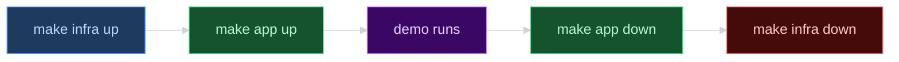
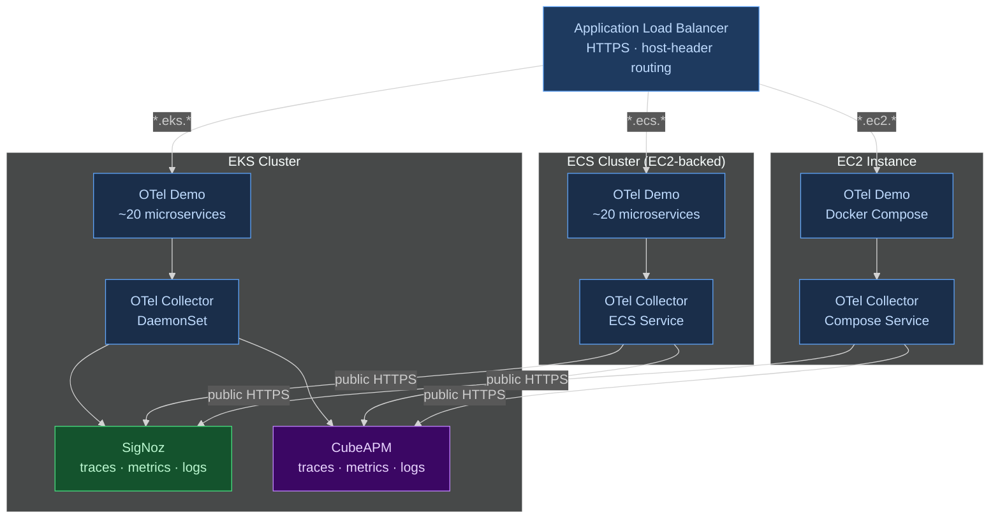
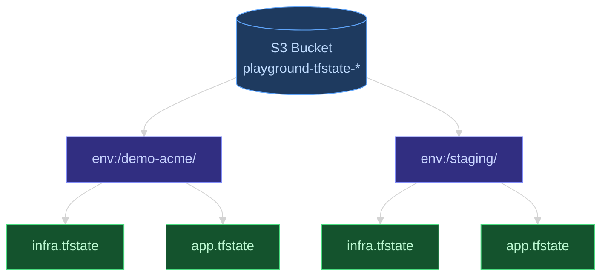
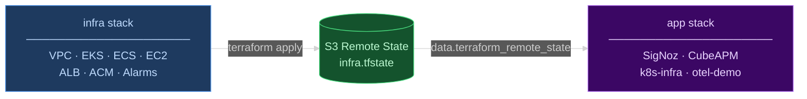
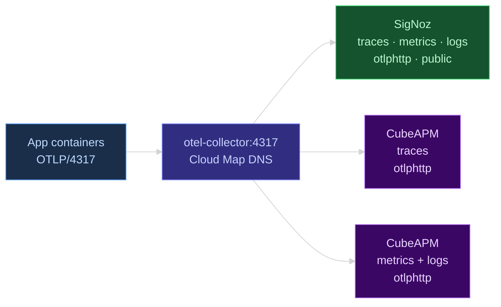
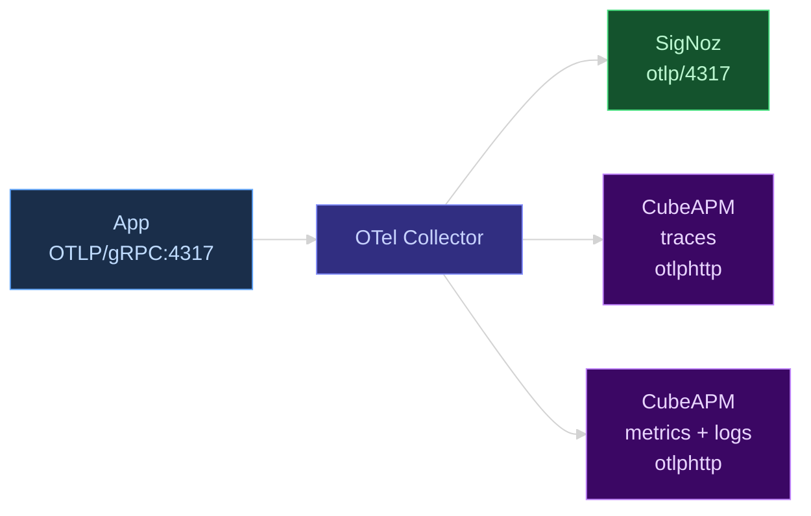
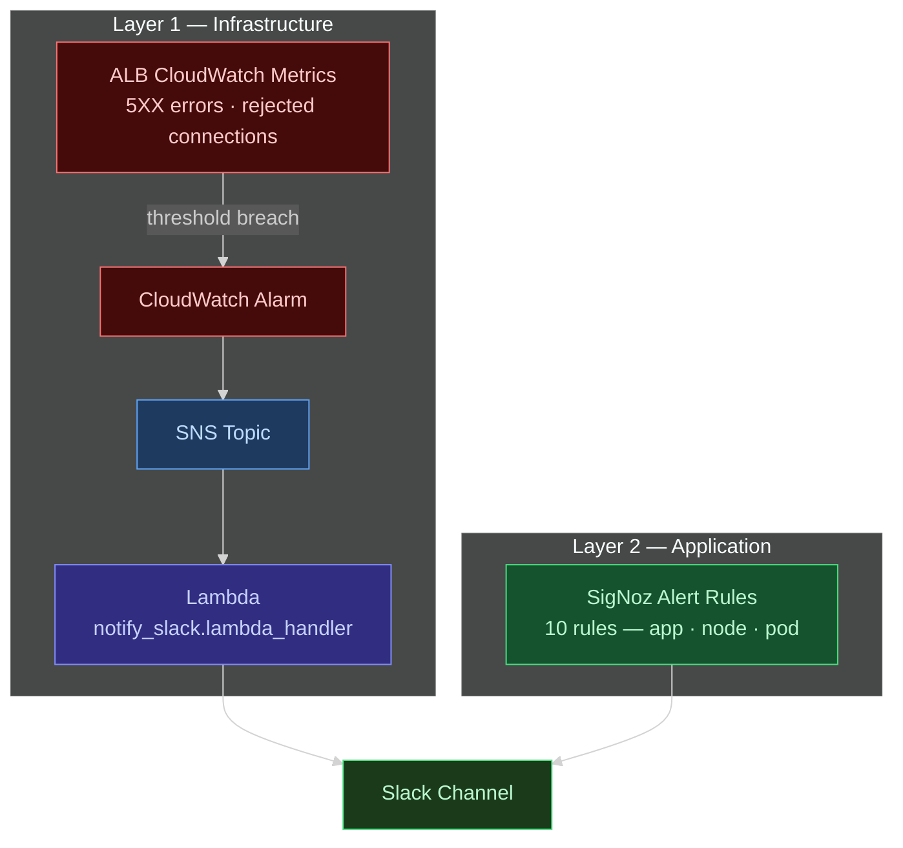

# Nuke and Pave: How We Built a Disposable AWS Playground for an AI SRE

## TL;DR

### What we built

**AI SRE infrastructure demo/testing platform for AI SRE Product**: infra-as-code–driven ephemeral playground infrastructure for Customer Demos, Internal Experiments, Failure injection and RCA evaluation for comparable Sherlocks.ai evaluations across environments.

### Why we built it this way

Ephemeral playgrounds provide a safe, isolated environment for testing and evaluation without the overhead of maintaining a persistent cluster. Ephemeral environments are drift-free, cheap, easy to create, and can be easily destroyed.

## TABLE OF CONTENTS

1. The Bigger Picture
2. What the Playground Looks Like (the 30-second tour)
3. The Architecture: Two Terraform Stacks to rule them all

- 3.1 Terraform Workspaces as Environment Isolation
- 3.2 Two Stacks, One Source of Truth
- 3.3 One ALB to Route Them All

4. EKS: Where the Observability Stack Lives

- 4.1 Why the APMs Land Here
- 4.2 The AWS Load Balancer Controller (and Why It's Required)
- 4.3 SigNoz and CubeAPM, Side by Side
- 4.4 OTel Collection on EKS: DaemonSet Agent

5. ECS: Where Kubernetes Engineers Get Humbled

- 5.1 Why ECS, and Why EC2-Backed (Not Fargate)
- 5.2 Service Discovery: The ECS Way
- 5.3 Six Phases of depends_on
- 5.4 Getting Artifacts onto the Node: S3 → SSM → Host

6. EC2: Docker Compose and Nothing Else
7. OTel Across Substrates: Same Collector, Three Deployment Models

- 7.1 The Fan-Out Pattern
- 7.2 Resource Enrichment: Knowing Where a Signal Came From
- 7.3 What the Substrate Dictates

8. Alerting: From CloudWatch to Slack in Three Hops
9. The Operator Interface: make and GitHub Actions

- 9.1 make as the Developer CLI
- 9.2 workflow_dispatch as the Frontend

10. What We Learned

## 1. The Bigger Picture

One of our customers came to us with a very specific problem: they wanted a reliable way to demo their **AI SRE product** to potential enterprise customers. Most of their current and potential customers were using AWS across three compute platforms: EKS, ECS, and EC2. For this, they needed an ephemeral playground infrastructure that can be created and destroyed with one click. The playground provides a consistent environment for testing and evaluation, without the overhead of maintaining a persistent cluster(s).

If the environment is fully recreatable from code, drift is structurally impossible: there's no
running state to drift from. The "nuke and pave" pattern means the playground
lives exactly as long as the demo, and then it's gone. Disposability isn't a tradeoff here; it's the feature
the whole design optimizes for.



## 2. What The Playground Looks Like (the 30-second tour)

The playground runs three AWS compute substrates simultaneously: EKS, ECS
(EC2-backed), and a standalone EC2 instance; all running the same workload:
the OpenTelemetry Demo, roughly twenty instrumented microservices in Go, Java,
Python, .NET, Rust, and more. A single Application Load Balancer routes traffic
to the right substrate using host-header rules based on subdomain. The point
isn't redundancy; it's breadth. Enterprises run all three, and the AI SRE needs
to demonstrate competence against all of them.



## 3. The Architecture: Two Terraform Stacks to rule them all

### 3.1. Terraform Workspaces as Environment Isolation

Terraform state lives in S3, partitioned by workspace. Every playground gets its own workspace: `prod`, `staging`, `demo-acme` and they co-exist in the same AWS account without state collision.



### 3.2 Two Stacks, One Source of Truth

The infrastructure is split into two independently managed Terraform stacks:
`infra` (everything before any app runs) and `app` (the applications
themselves). The `app` stack reads the `infra` stack's outputs via
`data.terraform_remote_state`. Each stack can be updated independently, which matters when you
want to tear down the apps without destroying the underlying infra.



### 3.3 One ALB to Route Them All

Single ALB. Three substrates. Three wildcard certs. This is the decision that makes the whole multi-substrate demo possible without spinning up three separate load balancers.

The ALB has a single HTTPS listener on port 443. Host-header routing rules send `*.eks.<workspace>.domain.com` traffic to EKS, `*.ecs.<workspace>.domain.com` to ECS, and `*.ec2.<workspace>.domain.com` to the standalone EC2 instance. HTTP redirects to HTTPS automatically. The ACM wildcard certs cover all three subdomain patterns per workspace, provisioned and DNS-validated through Cloudflare's DNS-01 challenge, so there's no manual approval step anywhere in the process.

How each substrate registers with the ALB is different:

- **EKS** uses `ip` target type :> pod IPs registered directly via `TargetGroupBinding` CRDs (more on this in §4.2)
- **ECS** uses `instance` target type in bridge mode :> dynamic host ports registered at the task level
- **EC2** registers the instance ID directly

All three target groups live under the same ALB. Add a compute substrate, add a listener rule and a target group. That's the whole operation.

---

## 4. EKS: Where the Observability Stack Lives

### 4.1 Why the APMs Land Here

Every substrate in this playground sends its telemetry somewhere. That somewhere is EKS and it's not arbitrary.

SigNoz runs ClickHouse for trace, log, and metric storage. CubeAPM has its own storage layer. Both are memory-hungry. The `t3.xlarge` nodes in the EKS cluster are sized for the APMs first, not the demo app. If you tried to run them on the ECS node or the standalone EC2 instance alongside twenty microservices, you'd be fighting OOM kills before the first demo request landed.

There's also an architectural constraint baked into the Terraform: the `eks_app` module is not count-gated. Even when `enable_ecs = true` and `enable_eks = false`, the monitoring stack on EKS still needs to be up. ECS and EC2 substrates ship their telemetry to SigNoz and CubeAPM over public HTTPS. The APMs just need to be reachable. Which means EKS is always on, regardless of what else you've enabled.

### 4.2 The AWS Load Balancer Controller (and Why It's Required)

The EKS deployment doesn't use NodePort services or a separate NLB. The AWS Load Balancer Controller registers pod IPs directly into the shared ALB target groups via `TargetGroupBinding` CRDs. Skip the controller, and you need a separate load balancer per cluster, the single-ALB architecture doesn't work without it.

A `TargetGroupBinding` is a EKS custom resource that links an ALB target group (provisioned by Terraform) to a Kubernetes service. The controller watches for these CRDs and handles target registration automatically: pod comes up, its IP gets registered; pod dies, IP gets deregistered. You don't manage that manually.

The controller gets deployed first, before anything else in the `app` stack runs. There's a 30-second explicit wait after installation, because the controller needs time to become ready before it can process CRDs. Skip that wait and your first `TargetGroupBinding` apply will race against a controller that isn't ready yet.

<!--
[NOTE FOR AUTHOR: Worth adding a note on Pod Identity vs IRSA here — the controller uses Pod Identity, not IRSA. If your readers are used to setting up IRSA for every controller, this is the newer approach and worth calling out explicitly.]
[NOTE FOR LLM: Write a short paragraph on why you should prefer pod identity vs IRSA: it's the modern, simpler and just works approach]
-->

### 4.3 SigNoz and CubeAPM, Side by Side

Both APMs live on EKS in separate namespaces. SigNoz gets `signoz.eks.<workspace>.domain.com`. CubeAPM gets `cubeapm.eks.<workspace>.domain.com`. They receive the exact same signals from the exact same collector.

That's the point. This isn't a failover setup, it's a live comparison. During a demo, you pull up both dashboards side by side and show the same trace in each. Same data, different product, same OTel pipeline underneath.

SigNoz is the open-source backend: ClickHouse under the hood, Helm chart `0.117.1`. CubeAPM is the commercial product at Helm chart `1.14.2`, with separate ingest endpoints for metrics, logs, and traces. Both write to EBS-backed storage provisioned by the EBS CSI driver addon running on the EKS cluster.

### 4.4 OTel Collection on EKS: DaemonSet Agent

The collector runs as two components, both deployed by SigNoz's `k8s-infra` Helm chart (`0.15.0`):

- An **OTel Agent** as a DaemonSet :> one instance per node, receives OTLP from applications on the same node
- A central **OTel Deployment** :> handles cluster-level metadata: node metrics, pod events

The `resourcedetection` processor runs with `["eks", "system"]` detectors. Every signal automatically picks up `k8s.node.name` and `k8s.pod.name`.

Fan-out is configured directly in the collector pipeline. SigNoz gets signals via the default `otlp` exporter on port 4317. CubeAPM gets three separate `otlphttp` exporters, one each for metrics (port 3130), logs, and traces. The config lives inline in the Terraform Helm values inside `modules/aws/eks-app/main.tf`.

---

## 5. ECS: Where Kubernetes Engineers Get Humbled

### 5.1 Why ECS, and Why EC2-Backed (Not Fargate)?

Short answer: Fargate costs more and it doesn't give you the same control over the network namespace, and you need that control.

In bridge mode, which is what lets you map dynamic host ports and use ECS Service Connect for inter-service DNS, Fargate is more restrictive. With twenty services that need to find each other at startup, that flexibility matters. EC2-backed also means you can mount host directories. The OTel Demo expects config artifacts (flagd configs, init SQL, OTel collector config) to be on disk before tasks start. On ECS EC2, you mount those from a host path. On Fargate, you'd need a different approach entirely.

<!--
[NOTE FOR AUTHOR: If you remember the specific Fargate limitation you hit — network mode constraint, port mapping behavior, Service Connect compatibility issue — this is the right place. The general statement works, but the exact blocker is more useful for readers who are actively evaluating Fargate vs EC2.]
-->

### 5.2 Service Discovery: The ECS Way

Here's what Kubernetes hides from you: service DNS doesn't just exist. Something creates it. On Kubernetes, that something is CoreDNS, and it's already running when your pods come up. On ECS in bridge mode, each task runs in its own isolated network namespace. No shared localhost. No automatic DNS registration.

ECS Service Connect solves this. Each service registers with a DNS alias in a private AWS Cloud Map namespace. Every service gets a `<service>.local` alias. The OTel Collector registers as `otel-collector:4317`. Every app container sends OTLP to that address and finds the right service. It works exactly like Kubernetes DNS once it's configured.

But it doesn't configure itself. You wire it up in each task definition.

NOTE: ECS Service connect is especially annoying because it hardcodes the DNS -> IP mapping into the `/etc/hosts` of the running container directly. This means that if the `frontend` service container gets created before the `backend` service, then the `frontend` container won't have the DNS -> IP mapping for any container created after it, and hence won't be able to find the `backend` service.



### 5.3 Six Phases of `depends_on`

Kubernetes readiness probes exist to solve a specific problem: service A shouldn't accept traffic until service B is healthy. ECS doesn't have a native equivalent at the deployment orchestration level.

Deploy all twenty services at once and they race. PostgreSQL isn't ready. Kafka isn't ready. Services that depend on them crash-loop, retry, maybe eventually come up, or they don't, and you're debugging a broken environment before the customer call starts.

The solution is to create a dependency map of all microservices, and start them in groups, each with an explicit Terraform `depends_on` waiting for the dependent services to get online. Here's what it looks like for `otel-demo` services:

```
Phase 1 → valkey-cart, postgresql, kafka, currency, quote, image-provider, flagd
Phase 2 → flagd-ui, llm, ad, accounting, cart, email, payment, fraud-detection, product-catalog, shipping
Phase 3 → product-reviews, recommendation, checkout
Phase 4 → frontend
Phase 5 → frontend-proxy  ← ALB target
Phase 6 → load-generator
```

It's more explicit than Kubernetes probe ordering. You might find it tedious. But the dependency graph is right there in the code, and it's simplest solution that I found to solve a problem that shouldn't exist.

### 5.4 Getting Artifacts onto the Node: S3 → SSM → Host

ECS task definitions reference host-mounted config files. Getting those files onto the EC2 node without SSH keys means going through `AWS Systems Manager`.

The flow:

1. `make app upload-src` :> clones the OTel Demo repo, bundles the config files (flagd config, init SQL, OTel collector config) as a zip, uploads to S3
2. Terraform's `terraform_data` resource fires a `local-exec` provisioner that sends an SSM `send-command` to the EC2 node
3. The node pulls the zip from S3 and extracts it to a known path
4. ECS task definitions mount from that path

No bastion host. No SSH keys in CI. The instance just needs the SSM Agent running and an IAM instance profile with the right permissions, the `ec2` Terraform module handles both.

One pattern worth knowing: the OTel Collector config isn't mounted as a file. It's injected as an `OTEL_CONFIG` environment variable. The `opentelemetry-collector-contrib` image supports this natively. Update the ECS task definition, restart the service, and the new collector config takes effect, without touching the filesystem.

<!--
[NOTE FOR AUTHOR: If you hit specific SSM issues — command timeouts, agent version mismatches, IAM permission gaps — this section is the right place to document them. Readers replicating this will hit the same rough edges.]
-->

---

## 6. EC2: Docker Compose and Nothing Else

The EC2 deployment is deliberately the simplest thing that works. Docker Compose, full stop.

The same artifact zip that lands on the ECS node also lands on the EC2 instance, same SSM mechanism, same S3 source. From there, `docker compose up -d` runs remotely via SSM. The `terraform_data` resource polls until the command completes and surfaces the logs if it fails.

`frontend-proxy` binds to a fixed host port. The ALB target group registers the EC2 instance ID directly. No orchestrator, no service mesh, no cluster.

The simplicity is intentional. EC2 with Docker Compose is the floor of the deployment complexity spectrum. When the AI SRE operates against all three substrates simultaneously, it's working with three meaningfully different environments, not the same environment with different labels. The `deployment.environment = ec2` tag on every signal means the APMs can filter by substrate. When you're correlating a trace to an infrastructure event on EC2, you're working with raw EC2 CloudWatch metrics, not pod-level Kubernetes metrics.

<!--
[NOTE FOR AUTHOR: If you have a concrete example from a real demo — e.g., the AI SRE correlating a checkout service latency spike to a CPU metric on the EC2 host — this is exactly the right place for it. That moment ties the infrastructure choice to the product value better than any abstract explanation.]
-->

---

## 7. OTel Across Substrates: Same Collector, Three Deployment Models

### 7.1 The Fan-Out Pattern

Every substrate :> EKS, ECS, EC2 <: sends telemetry to both SigNoz and CubeAPM from a single collector config. Zero application code changes. No separate instrumentation per backend. No per-APM SDK to install.

This is OTel's actual value proposition. Your application emits OTLP. The collector routes it wherever you point. Adding a third APM backend means adding an exporter block to the config, not a new instrumentation library, not a redeployment of your application.



### 7.2 Resource Enrichment: Knowing Where a Signal Came From

The metadata on each signal tells you which substrate it came from.

EKS signals go through `resourcedetection` with `["eks", "system"]` detectors, every signal automatically picks up `k8s.node.name` and `k8s.pod.name`. ECS and EC2 signals use `["env", "ec2", "system"]`, EC2 instance metadata gets attached without any configuration on the application side.

And every signal, regardless of substrate, gets `deployment.environment` stamped by a `resource` processor. `eks`, `ecs`, or `ec2`. When the AI SRE is correlating a trace to an infrastructure event, it always knows which substrate it's looking at. The information is in the signal itself.

### 7.3 What the Substrate Dictates

Same binary. Three deployment models. The substrate decides how the collector runs.

| Substrate | Collector deployment           | Service discovery                     | Network model      |
| --------- | ------------------------------ | ------------------------------------- | ------------------ |
| EKS       | DaemonSet + central Deployment | Pod DNS (`localhost:4317`)            | Kubernetes overlay |
| ECS       | Dedicated ECS service          | Cloud Map DNS (`otel-collector:4317`) | Bridge mode        |
| EC2       | Docker Compose service         | Compose network                       | Host bridge        |

On EKS, applications emit OTLP to `localhost:4317`, the DaemonSet agent is always on the same node. On ECS, they emit to `otel-collector:4317`, which Cloud Map resolves to the right container. On EC2, it's a Compose service on the same Docker network. Different plumbing, same end result.

---

## 8. Alerting

There are two alert layers in this playground. They operate independently and both land in the same Slack channel.

**Layer 1: Infrastructure-level (ALB → Slack)**

Two CloudWatch alarms sit at the ALB: one for 5XX error counts, one for rejected connections. When either threshold trips, CloudWatch fires to an SNS topic, which triggers a Python 3.12 Lambda. The Lambda formats the payload and posts to a Slack incoming webhook. Terraform provisions the entire chain, alarms, SNS topic, Lambda ZIP, IAM permissions, all of it. No manual setup.

**Layer 2: Application-level (SigNoz → Slack)**

SigNoz gets ten alert rules loaded by `signoz-init.py` via the SigNoz REST API:

- `app-high-error-rate`, `app-high-latency`
- `node-disk-pressure`, `node-high-cpu`, `node-high-memory`, `node-not-reachable`, `node-not-ready`
- `pod-crashloop`, `pod-high-cpu`, `pod-memory-exhaustion`

The script authenticates to SigNoz, creates an admin user, registers the Slack alert channel, and uploads each rule from `scripts/alerts/*.json`. You run it once after `make app up` via `make signoz-init`. It's idempotent, run it twice, it's fine.

ALB alarms tell you something's wrong at the infrastructure boundary. SigNoz alerts tell you what's wrong inside the application. Together they cover both layers, which is exactly what an AI SRE needs to start diagnosing.



---

## 9. The Operator Interface: `make` and GitHub Actions

### 9.1 `make` as the Developer CLI

The Makefile is the public API for the whole system. You don't need to know where the Terraform stacks live, how SSM commands are structured, or which Python script handles the SigNoz setup. You just run `make`.

```
make infra init        — scaffolds terraform.tfvars, wires up the S3 backend
make infra up          — provisions VPC, EKS, ECS, EC2, ALB, ACM, alarms
make app upload-src    — clones OTel Demo, bundles artifacts, pushes to S3
make app up            — deploys SigNoz, CubeAPM, k8s-infra, OTel Demo across all substrates
make signoz-init       — creates admin user, Slack channel, loads alert rules
make app down          — tears down all app deployments
make infra down        — destroys all infrastructure

Usage:
  make infra init [WORKSPACE=sample] [ACCOUNT_ID=196010726378] [REGION=us-east-1]
                  [DOMAIN_NAME=play.sherlocks.io] [VPC_CIDR=10.0.0.0/16]
                  [CLOUDFLARE_ZONE_ID=abc] [CLOUDFLARE_API_TOKEN=xyz]
  make infra plan [WORKSPACE=sample]
  make infra up   [WORKSPACE=sample]
  make infra down [WORKSPACE=sample]

Examples:
  make infra init WORKSPACE=sample ACCOUNT_ID=1234567890 REGION=us-west-2
  make infra up WORKSPACE=sample
  make app up WORKSPACE=sample APP=otel-demo
```

Order matters. `make infra up` before `make app up`. `make app down` before `make infra down`. The stacks are coupled by `data.terraform_remote_state`, the app stack reads infra outputs at plan time, so the infra stack has to exist first.

<!--
[NOTE FOR AUTHOR: Consider showing the actual `make help` output here. Readers adapting this for their own setup will go straight to "what can I run" — the real target list is more useful than a curated subset.]
-->

### 9.2 `workflow_dispatch` as the Frontend

For anything beyond your local machine :> CI, customer environment provisioning, end-of-day teardown, there are three GitHub Actions workflows:

**`provision.yml`** :> runs the full sequence: `make infra up`, `make app upload-src`, `make app up`, `make signoz-init`. Parameterized by workspace name and AWS region. Triggerable via `workflow_dispatch` (manual, from the GitHub UI) or `workflow_call` (composable from another workflow).

**`destroy.yml`** :> runs `make app down` then `make infra down`. Same parameters.

**`main-lifecycle.yml`** :> wired to `push` on `main`. Calls `provision.yml` then `destroy.yml` end-to-end. It's a full integration test: provision the environment, verify it comes up, tear it down. Every merge to main proves the lifecycle still works.

All required credentials live as GitHub Secrets: `AWS_ACCESS_KEY_ID`, `AWS_SECRET_ACCESS_KEY`, `CLOUDFLARE_ZONE_ID`, `CLOUDFLARE_API_TOKEN`, `SLACK_WEBHOOK_URL`, `CUBEAPM_TOKEN`, `CUBEAPM_SESSION_KEY`.

`workflow_dispatch` with explicit workspace and region inputs means anyone on the team can spin up a named playground from the GitHub UI, no terminal, no Terraform knowledge required. Point, click, wait ten minutes.

---

## 10. What We Learned

**ECS bridge mode is not EKS.** Kubernetes abstracts a lot of the complexity that ECS makes you handle explicitly :> service discovery, startup ordering, network namespace isolation. ECS Service Connect is the right answer for discovery, but you wire it up per service, manually. The six-phase deployment exists because we tried single-phase first. It didn't work. That's not a knock on ECS; it's just what the platform asks you to own that Kubernetes hides from you.

**Disposability requires discipline up front.** Every resource needs a Terraform block. Nothing by hand, "by hand" means it won't be destroyed automatically, which means it's already drift. The overhead is real. When you just want to test something quickly, writing a Terraform resource first is friction. But `terraform destroy` leaves nothing behind. No orphaned ENIs, no forgotten S3 buckets, no surprise bill at the end of the month. The payoff is structurally enforced.

**OTel is a routing layer, not just an instrumentation standard.** The two-APM fan-out is the most concrete demonstration of this. Same signals, same collector, two destinations. Adding a third backend is adding an exporter block. The application doesn't know or care. That's not a theoretical benefit, the playground runs it live. That's the bet the product is making, and this environment proves it works every time it spins up.

<!--
[NOTE FOR AUTHOR: Close with something actionable — a link to the repo if it's public, or an invitation to try the pattern with your own APM backend. The writing advice from §1: end with something that makes the reader want to do something, not just finish reading.]
-->
